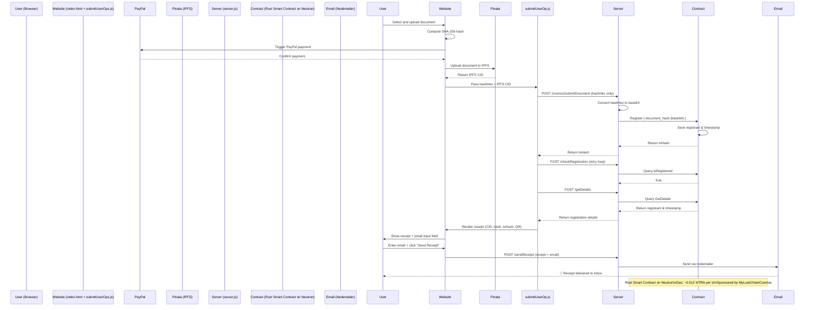

# 🌌 MyLockChainCosmos

MyLockChainCosmos is your interstellar document vault — a decentralized registration platform that anchors your files into the Cosmos itself. Using CosmWasm smart contracts on Neutron, IPFS via Pinata, and PayPal for fiat payments, MyLockChainCosmos ensures your records live on chain and off-world. Gas fees are sponsored, so you can register proof-of-existence across the stars — no wallet required.

---

## 🚀 Overview

* **Frontend**: `index.html` + `submitUserOps.js`
* **Backend**: `server.js` (Node + Express + CosmJS + Nodemailer)
* **Blockchain**: Rust-based CosmWasm contract deployed on Neutron (Cosmos SDK chain)
* **Storage**: IPFS via Pinata
* **Payment**: PayPal (USD to cover IPFS pinning)
* **Gas**: \~0.012 NTRN per transaction (sponsored)

---

## ✅ Features

* Upload any document (PDF, JPG, PNG, MP4, etc.)
* Hash using SHA-256 (client-side)
* Store file on IPFS via Pinata
* Register hash to a Neutron smart contract (Rust)
* View or email your receipt (includes tx hash, IPFS CID, QR code)

---

## ⚖️ Security Model

* Hash is computed **client-side** before uploading
* Only the hash is sent to the blockchain, ensuring **file privacy**
* Rust smart contract saves the `document_hash`, `registrant`, and `timestamp`
* All timestamps are block-anchored and immutable

---
## 🌠 Becoming a Top-Tier DApp in Cosmos
## ✈️ Flow Diagram (Mermaid Sequence)



---

## 🏛 Smart Contract Modules

* `contract.rs` - handles instantiation, execution, and queries
* `msg.rs` - defines `Register`, `GetDetails`, and `IsRegistered` message types
* `state.rs` - stores mappings for document hash to registrant and timestamp
* `helpers.rs` - utility logic for hash encoding
* `error.rs` - custom contract errors
* `lib.rs` - entry point for compilation

---

## ⚖️ Example Receipt (UI or Email)

```
📄 LockChain Registration Receipt

File Name: title_deed.pdf
IPFS CID: QmXYZ...
Document Hash: 0xabc123...
Registered By: neutron1...
Timestamp: 2024-05-16 14:23:00
Contract: https://www.mintscan.io/neutron/account/neutron1...
Transaction: https://www.mintscan.io/neutron/tx/ABCDEF123...
```

---

## ✉️ Email Delivery (Nodemailer)

When the user enters their email, `server.js` sends a structured HTML email using Gmail + App Password:

* Uses `EMAIL_USER` + `EMAIL_PASS` from `.env`
* HTML body matches on-screen receipt
* Delivered to inbox with subject: `Your LockChain Receipt for "filename.pdf"`

---

## 🚪 Privacy

* No documents are stored on-chain
* Hashing is deterministic, privacy-preserving
* Email is stored client-side only (via localStorage) and never persisted

---

## 🌌 Powered By

* [Neutron](https://neutron.org/) - CosmWasm smart contracts on Cosmos
* [Pinata](https://www.pinata.cloud/) - IPFS file pinning
* [PayPal](https://paypal.com) - User-friendly fiat payments
* [CosmJS](https://github.com/cosmos/cosmjs) - JS library for interacting with CosmWasm contracts
* [Nodemailer](https://nodemailer.com/) - Email receipts

---

## 🔧 Setup (Backend)

```bash
# Install dependencies
npm install

# Set up .env file
COSMOS_MNEMONIC=...
COSMOS_RPC=https://...
CONTRACT_ADDRESS=neutron1...
EMAIL_USER=...
EMAIL_PASS=...

# Start the server
node server.js
```

---

## 🌐 Frontend Hosting

The entire `index.html` + assets can be deployed to [Netlify](https://netlify.app), Vercel, or GitHub Pages.

---

## 🏦 Contact

Email: [contact@mylockchain.io](mailto:Luke@mylockchain.io)

